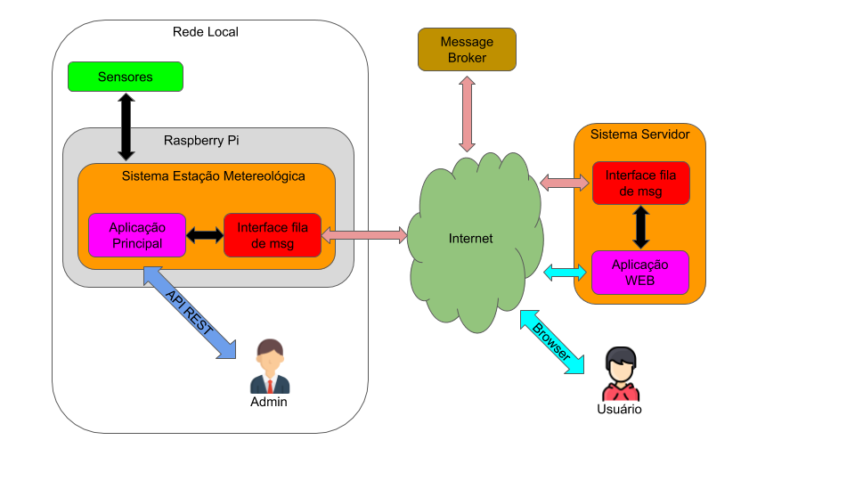

### Diagrama geral do Projeto

## Organização do Repositório

- **Documentação:**
  - [Modelagem - Diagramas](./doc/README.md)

- **Sistema Estação:**
  - [Código Fonte - Tutoriais](https://github.com/fpcardoso/projeto-estacao-meteorologica/tree/main/estacao)

- **Sistema Servidor:**
  - Código Fonte - Removido
